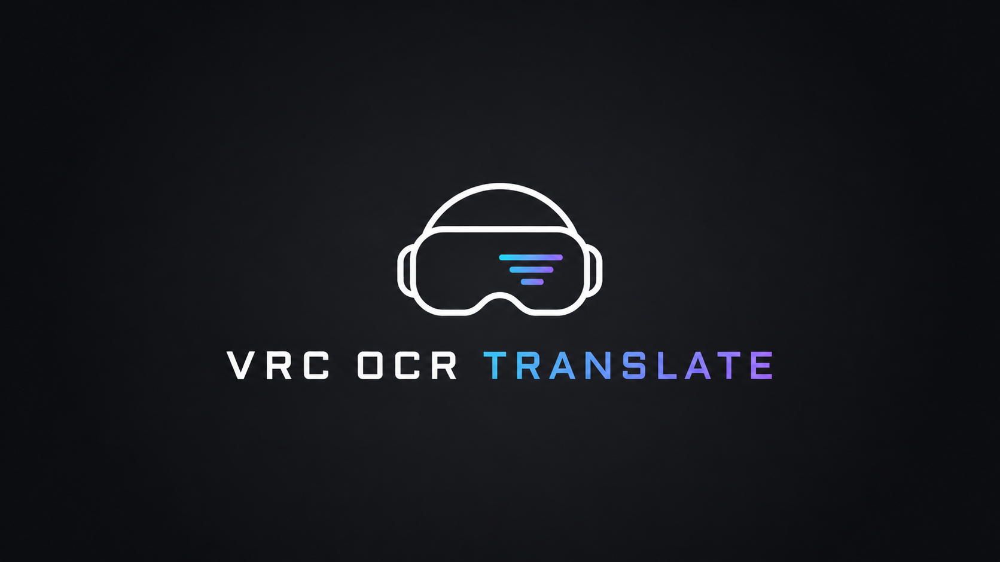
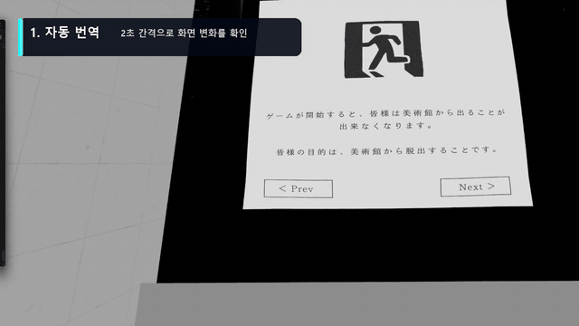

<a id="korean"></a>

<div align="center">



# VRC OCR Translate

[한국어](#korean) · [English](#english) · [日本語](#japanese)

**VRChat 속 여러 언어를 자동으로 읽고, 내가 고른 언어로 그 자리에 자막을 띄워주는 로컬 AI 도구입니다.**

[](https://www.python.org/)
[](https://store.steampowered.com/app/250820/SteamVR/)
[](#-어떻게-작동하나요)
[](LICENSE)

API 키도, 번역 서버도 필요 없습니다. 번역은 전부 내 PC에서 돌아갑니다. ✨

</div>

## 🎬 사용 영상

[](assets/demo.mp4)

GIF는 README에서 바로 재생되는 짧은 미리보기입니다. **이미지를 누르면 1080p 전체 영상**을 볼 수 있습니다.

시연 순서는 `자동 번역` → `수동 번역` → `자막 위치 조정`입니다.

## 🌟 이런 프로그램이에요

- 한국어, 일본어, 중국어와 주요 유럽 언어를 자동 인식합니다.
- 컨트롤 패널에서 **내 언어**를 고르면 번역 자막과 UI가 함께 바뀝니다.
- **번역할 언어**는 자동 인식하거나 특정 언어 하나로 제한할 수 있습니다.
- 번역문을 원문이 있던 위치 근처에 띄웁니다.
- 자막끼리 겹치면 읽기 편한 빈 공간으로 살짝 이동합니다.
- 2초마다 확인하는 자동 모드와 컨트롤러로 요청하는 수동 모드를 지원합니다.
- 실행하면 작은 컨트롤 패널이 떠서 버튼으로도 조작할 수 있습니다.
- VRChat 게임 창만 읽기 때문에 바탕화면이나 번역 자막이 다시 번역되는 일을 막습니다.
- Papago나 DeepL 같은 외부 API를 사용하지 않습니다. 🔒

## 🚀 정말 쉬운 설치

PowerShell 명령어나 Python 설치 방법을 몰라도 괜찮습니다.

1. GitHub 위쪽의 **Code → Download ZIP**을 누릅니다.
2. 받은 ZIP 파일의 압축을 풉니다.
3. 폴더 안의 **`INSTALL.bat`을 더블클릭**합니다.
4. 설치가 끝나면 Virtual Desktop, SteamVR, VRChat을 실행합니다.
5. **`RUN_TRANSLATOR.bat`을 더블클릭**합니다.

첫 설치에는 약 3GB를 내려받으므로 시간이 조금 걸릴 수 있습니다. `INSTALL.bat`이 아래 작업을 알아서 처리합니다.

- 프로젝트 전용 실행 도구 설치
- Python 3.12와 필요한 패키지 준비
- 개인 설정 파일 `config.json` 생성
- TranslateGemma 모델과 llama.cpp Vulkan 런타임 다운로드
- 일본어 전용·동아시아·한국어·라틴 문자용 OCR 모델 준비
- 모델 파일 무결성 확인

설치 중 문제가 생기면 인터넷 연결을 확인한 뒤 `INSTALL.bat`을 다시 실행해 주세요.

<details>
<summary>Git으로 받고 싶은 사용자</summary>

```text
git clone https://github.com/RezisEwig/VRC_OCR_Translate.git
cd VRC_OCR_Translate
```

그다음 `INSTALL.bat`을 실행하면 됩니다.

</details>

## 🎮 조작법

`RUN_TRANSLATOR.bat`을 실행하면 작은 컨트롤 패널이 함께 열립니다. 맨 위의 **내 언어**에서 원하는 번역 결과 언어를 고르세요. 선택은 `config.json`에 저장되고, 번역 대상과 컨트롤 패널 문구가 즉시 같은 언어로 바뀝니다.

### 컨트롤 패널 UI

| UI | 역할 |
| --- | --- |
| **내 언어** | 번역 결과와 컨트롤 패널에 사용할 언어 |
| **번역할 언어** | VRChat 화면에 보이는 원문의 언어. 자동 인식 또는 개별 언어 선택 |
| **자동 번역 / 수동 번역** | 2초 간격 자동 확인 또는 요청할 때만 번역 |
| **지금 번역** | 현재 화면을 한 번 번역하고 유지 |
| **자막 지우기** | VR에 떠 있는 번역 자막 전체 삭제 |
| **자막 위치** | 방향, 크기, 초기화 버튼으로 오버레이 보정 |

**번역할 언어**는 원문의 언어입니다. 여러 언어가 섞여 나오면 `자동 인식`을 사용하세요. 일본어 월드처럼 원문 언어를 이미 안다면 `日本語`처럼 하나를 직접 고를 수 있습니다. 이 경우 필요한 OCR 인식기 하나만 실행하므로 CPU 사용량과 OCR 시간이 줄어듭니다.

원문 언어를 정확히 지정하면 언어 감지 단계를 건너뛰고 해당 언어 전용 OCR과 번역 프롬프트를 사용하므로 **자동 인식보다 번역 품질도 일반적으로 좋아집니다.** 특히 `日本語 → 한국어` 조합은 일본어 전용 OCR과 일본어→한국어 전용 프롬프트를 사용합니다.

지원하는 언어는 다음 10개입니다.

| 한국어 | 日本語 | 简体中文 | 繁體中文 | English |
| --- | --- | --- | --- | --- |
| Español | Français | Deutsch | Português | Italiano |

그 아래에서 **자동/수동 전환**, **한 번 번역**, **자막 지우기**, **자막 위치 조정**, **배율 조정**을 버튼으로 누를 수 있습니다.

| 입력 | 동작 |
| --- | --- |
| 왼쪽 컨트롤러 트리거 | 지금 보고 있는 화면을 한 번 번역하고 유지 |
| 왼쪽 컨트롤러 그립 | 떠 있는 번역 자막 모두 지우기 |
| `Ctrl+Alt+T` | 자동 번역 ↔ 수동 번역 전환 |
| `Ctrl+Alt+왼쪽/오른쪽` | 자막 전체를 좌우로 이동 |
| `Ctrl+Alt+위/아래` | 자막 전체를 위아래로 이동 |
| `Ctrl+Alt+숫자패드 + / -` | 자막 위치의 가로·세로 배율 조정 |
| `Ctrl+Alt+Home` | 자막 위치와 배율 초기화 |

위치 조정값은 `config.json`에 자동 저장됩니다. 한 번 눈에 맞게 조절해 두면 다음 실행에도 그대로 유지됩니다. 👍

마지막으로 사용한 자동/수동 번역 모드도 저장되므로 다음 실행에서 그대로 시작합니다.

트리거와 그립 입력은 가로채지 않고 읽기만 합니다. 따라서 번역을 요청하거나 자막을 지우는 동시에 VRChat 안에서도 기존 트리거·그립 동작이 그대로 실행됩니다.

컨트롤 패널이 필요 없다면 `config.json`에서 `controls.show_panel`을 `false`로 바꾸면 됩니다.

## 🖥️ 테스트 환경과 권장 사양

| 항목 | 내용 |
| --- | --- |
| 테스트한 헤드셋 | Meta Quest Pro |
| PC 연결 | Virtual Desktop |
| VR 환경 | SteamVR / OpenVR |
| 테스트 GPU | NVIDIA GeForce RTX 5070 Ti |
| 운영체제 | Windows 11 |
| RAM | 16GB 이상 권장 |
| VRAM | 8GB 이상 권장 |
| 저장 공간 | 약 4GB 여유 공간 |

RapidOCR는 CPU를 사용하고 TranslateGemma 번역은 Vulkan GPU를 사용합니다. 번역기 자체는 VRAM을 약 3GB 안팎 사용하지만 VRChat과 함께 실행해야 하므로 여유 있는 GPU가 좋습니다.

## ⚠️ 알아둘 점

- 현재 **Quest Pro + Virtual Desktop + SteamVR** 조합에서만 실사용 테스트했습니다.
- 다른 Quest 기기, Steam Link, 유선 PC VR에서도 동작할 가능성은 있지만 아직 확인하지 못했습니다.
- 자막은 VR 월드의 실제 3D 표면이 아니라 눈에 보이는 2D 화면 위치를 기준으로 붙습니다.
- 언어는 자동 감지하지만 중국어와 일본어의 한자는 문자 모양만으로 완전히 구분하기 어려워 번역 모델이 문맥으로 판단합니다.
- 세로쓰기, 장식 글꼴, 너무 작거나 흐린 글자는 놓칠 수 있습니다.
- 로컬 4B 모델이라 긴 문맥, 고유명사, 복잡한 문장은 가끔 엉뚱하게 번역할 수 있습니다.
- Quest Pro 시선 추적 번역은 아직 구현되지 않았습니다.
- VRChat, SteamVR, Virtual Desktop, Meta의 공식 프로젝트가 아닙니다.

## 🧩 어떻게 작동하나요

간단히 말하면 이렇습니다.

```text
VRChat 화면
  → 일본어 전용·동아시아·한국어·라틴 문자 OCR로 글자와 위치 찾기
  → TranslateGemma가 선택한 언어로 번역
  → SteamVR 위에 번역 자막 표시
```

조금 더 깊은 구조가 궁금하다면 [DESIGN.md](DESIGN.md)를 참고해 주세요.

<details>
<summary>설정과 진단 기능 보기</summary>

- `CHECK_LOCAL_AI.bat`: OCR와 GPU 번역 준비 상태 확인
- `TEST_OVERLAY.bat`: SteamVR 자막 표시만 테스트
- `OPEN_LOG.bat`: 최근 실행 로그 열기
- `config.example.json`: 바꿀 수 있는 전체 설정 예시

자주 조정하는 값:

- `capture.interval_ms`: 자동 번역 주기, 기본 2000ms
- `ocr.confidence_threshold`: OCR 최소 신뢰도
- `ocr.auto_detect_languages`: 지원 문자권 자동 인식 여부
- `translation.source_language`: 번역할 원문 언어, 기본 `auto`
- `translation.target_language`: UI에서 고른 내 언어
- `overlay.min_font_size`: 작은 원문 자막의 최소 글꼴 크기, 기본 10
- `overlay.background_alpha`: 자막 배경 투명도
- `overlay.collision_gap_px`: 자막끼리 떨어질 간격
- `controls.show_panel`: 데스크톱 컨트롤 패널 표시 여부

</details>

## 📜 라이선스

이 저장소의 코드와 문서는 [MIT License](LICENSE)로 공개됩니다.

TranslateGemma 모델은 별도의 [Gemma Terms of Use](https://ai.google.dev/gemma/terms)를 따릅니다. llama.cpp, RapidOCR, OpenVR 등 외부 구성 요소의 라이선스는 [THIRD_PARTY_NOTICES.md](THIRD_PARTY_NOTICES.md)에 정리했습니다.

## 🤖 이 레포를 만든 방식

이 저장소의 **코드, 스크립트, 테스트, 문서는 OpenAI Codex가 100% 작성했습니다.**

RezisEwig는 아이디어와 요구사항을 제시하고 Quest Pro 안에서 직접 테스트하며 피드백을 담당했습니다. 사람이 VR에서 느낀 불편을 이야기하고, AI가 구현하고, 다시 실제 VR에서 확인하는 방식으로 함께 완성한 프로젝트입니다.

버그를 발견했다면 사용 중인 헤드셋, 연결 방식, GPU와 함께 GitHub Issue에 알려주세요. 더 많은 VR 환경에서 잘 돌아가도록 만드는 데 큰 도움이 됩니다! 🙌

---

<a id="english"></a>

<div align="center">

# English

[한국어](#korean) · [English](#english) · [日本語](#japanese)

**A local AI tool that reads text in VRChat and places translated subtitles near the original text in VR.**

No API key or external translation service is required. OCR and translation run locally on your PC. ✨

</div>

## 🎬 Demo

[](assets/demo.mp4)

The GIF plays directly in GitHub. Click it to open the full 1080p demo video.

## 🌟 Features

- Automatically recognizes Korean, Japanese, Chinese, English, and major European languages.
- Translates into the language selected under **My language**.
- Changes the entire control panel UI to the selected language.
- Lets you auto-detect the source language or select one specific language.
- Places each translated subtitle close to its original screen position.
- Moves overlapping subtitle bubbles into nearby free space.
- Supports automatic translation every two seconds and on-demand manual translation.
- Captures only the VRChat game window, preventing desktop and subtitle feedback loops.
- Uses local RapidOCR and TranslateGemma instead of Papago or DeepL. 🔒

## 🚀 Easy Installation

You do not need to know PowerShell or install Python manually.

1. Click **Code → Download ZIP** at the top of the GitHub repository.
2. Extract the downloaded ZIP file.
3. Double-click **`INSTALL.bat`**.
4. Start Virtual Desktop, SteamVR, and VRChat after installation finishes.
5. Double-click **`RUN_TRANSLATOR.bat`**.

The first installation downloads about 3 GB. The installer automatically prepares Python 3.12, required packages, OCR models, TranslateGemma, and the llama.cpp Vulkan runtime.

## 🎛️ Control Panel UI

| UI item | Purpose |
| --- | --- |
| **My language** | Target language used for translated subtitles and the control panel UI |
| **Source language** | Language visible in VRChat; choose Auto detect or one specific language |
| **Automatic / Manual** | Translate every two seconds or only when requested |
| **Translate now** | Translate the current view once and keep the result visible |
| **Clear subtitles** | Remove every floating translation subtitle |
| **Subtitle position** | Move, scale, or reset the overlay alignment |

Use **Auto detect** when several languages may appear together. When you already know the source language, select it explicitly. This skips language guessing and runs only the appropriate OCR recognizer, reducing CPU work and usually improving translation accuracy and speed.

For example, selecting `日本語` with Korean as **My language** activates the dedicated Japanese OCR model and Japanese-to-Korean translation prompt. This is generally more accurate than automatic detection for Japanese-only worlds.

Supported target and source languages:

| 한국어 | 日本語 | 简体中文 | 繁體中文 | English |
| --- | --- | --- | --- | --- |
| Español | Français | Deutsch | Português | Italiano |

Language choices, subtitle calibration, and the last automatic/manual mode are saved to `config.json`.

## 🎮 Controls

| Input | Action |
| --- | --- |
| Left controller trigger | Translate the current screen once and keep the subtitles visible |
| Left controller grip | Clear all translated subtitles |
| `Ctrl+Alt+T` | Toggle automatic and manual translation |
| `Ctrl+Alt+Left/Right` | Move every subtitle horizontally |
| `Ctrl+Alt+Up/Down` | Move every subtitle vertically |
| `Ctrl+Alt+Numpad + / -` | Scale subtitle position mapping |
| `Ctrl+Alt+Home` | Reset subtitle position and scale |

Controller input is observed without consuming it, so trigger and grip actions continue to work normally inside VRChat.

## 🖥️ Tested Setup and Requirements

| Item | Details |
| --- | --- |
| Tested headset | Meta Quest Pro |
| PC connection | Virtual Desktop |
| VR runtime | SteamVR / OpenVR |
| Tested GPU | NVIDIA GeForce RTX 5070 Ti |
| Operating system | Windows 11 |
| Memory | 16 GB or more recommended |
| VRAM | 8 GB or more recommended |
| Free storage | About 4 GB |

RapidOCR runs on the CPU, while TranslateGemma uses the GPU through Vulkan. The translation model uses roughly 3 GB of VRAM, so additional headroom is recommended when running it beside VRChat.

## ⚠️ Limitations

- Real-world testing has currently been limited to Quest Pro + Virtual Desktop + SteamVR.
- Other Quest headsets, Steam Link, and wired PC VR may work but have not been verified.
- Subtitle anchors are based on the visible 2D image, not actual 3D world surfaces.
- Vertical text, decorative fonts, very small text, and blurred text may be missed.
- Chinese and Japanese text made only of shared Han characters can be difficult to distinguish automatically.
- The local 4B model can mistranslate specialized terminology, names, and complex passages.
- Quest Pro eye-tracking translation is not implemented yet.
- This is not an official project of VRChat, SteamVR, Virtual Desktop, or Meta.

## 🧩 How It Works

```text
VRChat game window
  → Japanese / East Asian / Korean / Latin OCR models
  → TranslateGemma translates into My language
  → Positioned subtitles are rendered through a SteamVR overlay
```

See [DESIGN.md](DESIGN.md) for implementation details.

## 📜 License and Authorship

The code and documentation are available under the [MIT License](LICENSE). TranslateGemma follows the separate [Gemma Terms of Use](https://ai.google.dev/gemma/terms). Other dependencies are listed in [THIRD_PARTY_NOTICES.md](THIRD_PARTY_NOTICES.md).

**All code, scripts, tests, and documentation in this repository were written by OpenAI Codex.** RezisEwig provided the concept, requirements, real Quest Pro testing, and iterative feedback.

---

<a id="japanese"></a>

<div align="center">

# 日本語

[한국어](#korean) · [English](#english) · [日本語](#japanese)

**VRChat内の文字を読み取り、元の位置に近い場所へ翻訳字幕を表示するローカルAIツールです。**

APIキーや外部翻訳サービスは不要です。OCRと翻訳はすべてPC上で動作します。✨

</div>

## 🎬 デモ動画

[](assets/demo.mp4)

GIFはGitHub上でそのまま再生されます。クリックすると1080pのデモ動画を開けます。

## 🌟 主な機能

- 韓国語、日本語、中国語、英語、主要なヨーロッパ言語を自動認識します。
- **自分の言語**で選択した言語へ翻訳します。
- 選択した言語に合わせてコントロールパネル全体の表示も切り替わります。
- 原文の言語を自動検出するか、特定の1言語に固定できます。
- 翻訳字幕を元の文字があった画面位置の近くへ表示します。
- 字幕同士が重なる場合は、近くの空いている場所へ移動します。
- 2秒ごとの自動翻訳と、必要な時だけ実行する手動翻訳に対応します。
- VRChatのゲームウィンドウだけを取得し、デスクトップや翻訳字幕の再認識を防ぎます。
- PapagoやDeepLではなく、ローカルのRapidOCRとTranslateGemmaを使用します。🔒

## 🚀 かんたんインストール

PowerShellやPythonの知識は必要ありません。

1. GitHub上部の **Code → Download ZIP** をクリックします。
2. ダウンロードしたZIPを展開します。
3. **`INSTALL.bat`** をダブルクリックします。
4. インストール完了後、Virtual Desktop、SteamVR、VRChatを起動します。
5. **`RUN_TRANSLATOR.bat`** をダブルクリックします。

初回は約3 GBをダウンロードします。Python 3.12、必要なパッケージ、OCRモデル、TranslateGemma、llama.cpp Vulkanランタイムは自動で準備されます。

## 🎛️ コントロールパネル

| UI項目 | 機能 |
| --- | --- |
| **自分の言語** | 翻訳結果とコントロールパネルに使用する翻訳先言語 |
| **翻訳する言語** | VRChat画面に表示されている原文の言語。自動検出または個別言語を選択 |
| **自動翻訳 / 手動翻訳** | 2秒ごとに翻訳するか、要求した時だけ翻訳するかを切り替え |
| **今すぐ翻訳** | 現在の画面を1回翻訳し、そのまま表示 |
| **字幕を消去** | VRに表示中の翻訳字幕をすべて削除 |
| **字幕位置** | オーバーレイの移動、拡大縮小、初期化 |

複数言語が混在する場合は **自動検出** が便利です。原文の言語が分かっている場合は、個別言語を指定してください。言語判定を省略して必要なOCRモデルだけを実行するため、CPU負荷と処理時間が減り、通常は翻訳精度も向上します。

たとえば、**自分の言語**を韓国語、**翻訳する言語**を `日本語` にすると、日本語専用OCRと日本語→韓国語専用プロンプトが使用されます。日本語だけのワールドでは自動検出より安定した品質が期待できます。

対応言語は次の10言語です。

| 한국어 | 日本語 | 简体中文 | 繁體中文 | English |
| --- | --- | --- | --- | --- |
| Español | Français | Deutsch | Português | Italiano |

言語設定、字幕位置、最後に使用した自動/手動モードは `config.json` に保存されます。

## 🎮 操作方法

| 入力 | 動作 |
| --- | --- |
| 左コントローラーのトリガー | 現在の画面を1回翻訳して字幕を維持 |
| 左コントローラーのグリップ | 翻訳字幕をすべて消去 |
| `Ctrl+Alt+T` | 自動翻訳と手動翻訳を切り替え |
| `Ctrl+Alt+左/右` | 字幕全体を左右に移動 |
| `Ctrl+Alt+上/下` | 字幕全体を上下に移動 |
| `Ctrl+Alt+テンキー + / -` | 字幕位置のスケールを調整 |
| `Ctrl+Alt+Home` | 字幕位置とスケールを初期化 |

コントローラー入力は消費せずに監視するため、VRChat内のトリガーとグリップ操作もそのまま動作します。

## 🖥️ テスト環境と推奨スペック

| 項目 | 内容 |
| --- | --- |
| テスト済みHMD | Meta Quest Pro |
| PC接続 | Virtual Desktop |
| VRランタイム | SteamVR / OpenVR |
| テスト済みGPU | NVIDIA GeForce RTX 5070 Ti |
| OS | Windows 11 |
| メモリ | 16 GB以上を推奨 |
| VRAM | 8 GB以上を推奨 |
| 空き容量 | 約4 GB |

RapidOCRはCPU、TranslateGemmaはVulkan経由でGPUを使用します。翻訳モデル単体で約3 GBのVRAMを使用するため、VRChatと同時に動かすには余裕のあるGPUを推奨します。

## ⚠️ 制限事項

- 現在、Quest Pro + Virtual Desktop + SteamVRの構成でのみ実機テスト済みです。
- 他のQuest、Steam Link、有線PC VRでも動作する可能性はありますが、未検証です。
- 字幕は3Dオブジェクト表面ではなく、見えている2D画面位置を基準に配置されます。
- 縦書き、装飾フォント、非常に小さい文字、ぼやけた文字は認識できない場合があります。
- 漢字だけの日本語と中国語は自動判別が難しい場合があります。
- ローカル4Bモデルのため、専門用語、固有名詞、複雑な長文を誤訳することがあります。
- Quest Proのアイトラッキング翻訳はまだ実装されていません。
- VRChat、SteamVR、Virtual Desktop、Metaの公式プロジェクトではありません。

## 🧩 動作の流れ

```text
VRChatゲームウィンドウ
  → 日本語専用 / 東アジア / 韓国語 / ラテン文字OCR
  → TranslateGemmaが「自分の言語」へ翻訳
  → SteamVRオーバーレイに位置付き字幕を表示
```

詳しい設計は [DESIGN.md](DESIGN.md) を参照してください。

## 📜 ライセンスと作成方法

コードとドキュメントは [MIT License](LICENSE) で公開されています。TranslateGemmaには別途 [Gemma Terms of Use](https://ai.google.dev/gemma/terms) が適用されます。その他の依存関係は [THIRD_PARTY_NOTICES.md](THIRD_PARTY_NOTICES.md) にまとめています。

**このリポジトリのコード、スクリプト、テスト、ドキュメントはすべてOpenAI Codexが作成しました。** RezisEwigはアイデア、要件、Quest Proでの実機テスト、フィードバックを担当しました。
